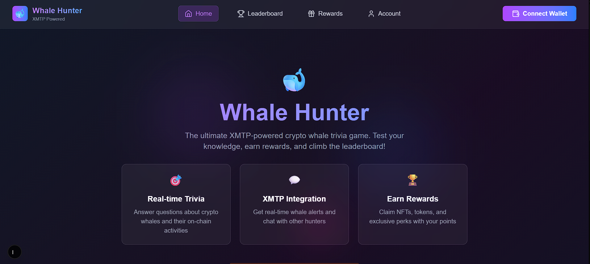
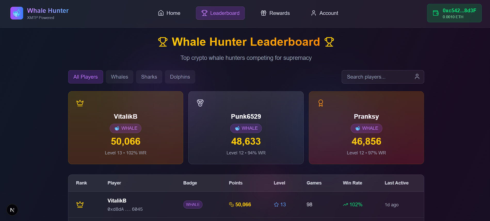
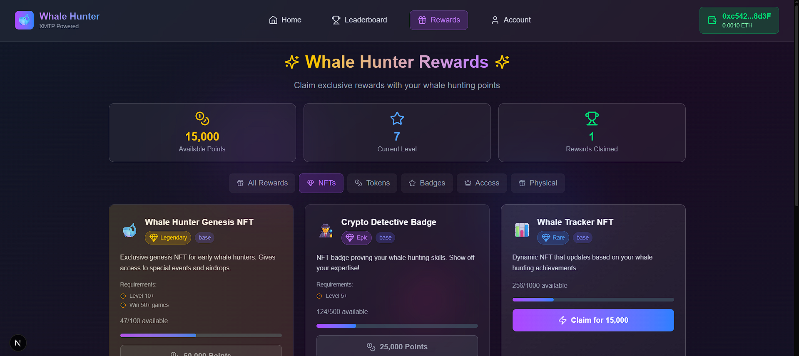
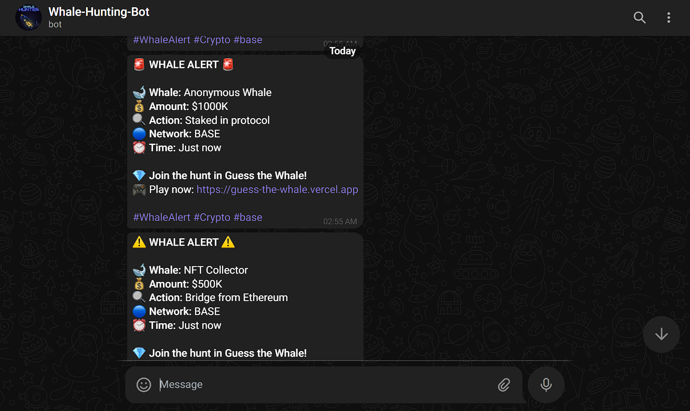
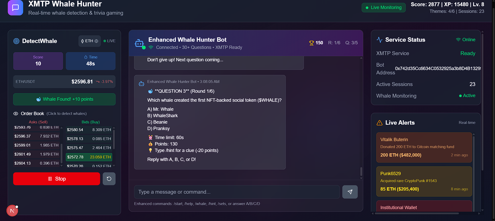

# 🐋 Guess the Whale - AI-Powered XMTP Game

Welcome to **Guess the Whale**, a revolutionary Web3 trivia game that combines **XMTP messaging**, **AI agents**, and **real-time onchain monitoring** for an immersive crypto whale hunting experience!


## 🚀 Revolutionary Features

### 💬 **XMTP Integration** 
- **Real-time Chat**: Live messaging with AI whale hunting bot
- **Group Games**: Multiplayer competitions via XMTP groups
- **Decentralized**: No central server - pure P2P messaging
- **Cross-platform**: Works across all XMTP-enabled apps

### 🤖 **AgentKit AI Power**
- **Smart Hints**: AI generates contextual clues based on real data
- **Natural Language**: Ask questions in plain English
- **Adaptive Difficulty**: Game adjusts to your skill level
- **Market Intelligence**: Real-time crypto insights and analysis

### 🔍 **Live Whale Detection**
- **Onchain Monitoring**: Real-time blockchain activity tracking
- **Instant Alerts**: Get notified when whales make moves
- **Multi-chain**: Ethereum, Base, and more networks
- **Smart Filters**: AI identifies significant transactions

### 🎮 **Immersive Gaming**
- **Progressive Hints**: Get increasingly easier clues
- **Time-based Scoring**: Race against the clock for bonuses
- **Streak Multipliers**: Build consecutive wins for massive points
- **Visual Effects**: Confetti, particles, and smooth animations

### 🎨 **Stunning Design**
- **Glassmorphism UI**: Modern, translucent design elements
- **Framer Motion**: Buttery smooth animations and transitions
- **Responsive**: Perfect on desktop, tablet, and mobile
- **Dark Theme**: Crypto-native aesthetic with neon accents

## 🚀 Quick Start

### Prerequisites
- Node.js 18+ 
- npm or yarn
- Git

### Installation

1. **Clone the repository**
   ```bash
   git clone https://github.com/yourusername/guess-the-whale.git
   cd guess-the-whale
   ```

2. **Install dependencies**
   ```bash
   npm install
   # or
   yarn install
   ```

3. **Start the development server**
```bash
npm run dev
# or
yarn dev
   ```

4. **Open your browser**
   Navigate to [http://localhost:3000](http://localhost:3000)

### 🎮 How to Play with XMTP

1. **Connect**: XMTP chat automatically initializes with your AI bot
2. **Start Hunting**: Type `/start` in chat to begin whale hunting  
3. **Get Hints**: AI provides contextual clues about famous crypto whales
4. **Guess**: Type whale names directly in chat or game interface
5. **React to Alerts**: Real-time whale alerts appear - guess fast for bonus points!
6. **Compete**: Challenge friends via XMTP group chats

## 🛠️ Tech Stack

### Frontend
- **Next.js 14** - React framework with App Router
- **TypeScript** - Type-safe development
- **Tailwind CSS** - Utility-first CSS framework
- **Framer Motion** - Production-ready motion library

### Web3 & AI Integration
- **XMTP** - Decentralized messaging for real-time chat
- **AgentKit** - Coinbase AI agent framework  
- **Ethers.js** - Ethereum library for wallet interactions
- **Base Network** - L2 blockchain integration ready
- **OpenAI** - AI-powered hint generation and chat

### Development Tools
- **ESLint** - Code linting
- **PostCSS** - CSS processing
- **Lucide React** - Beautiful icons

## 🎯 Game Rules

### Objective
Identify famous crypto personalities and whales based on hints about their wallet activities and contributions to the space.

### How to Play
1. **Start the Game**: Click "Start Hunting Whales" to begin
2. **Read the Hint**: Each round starts with a cryptic clue about a famous wallet
3. **Make Your Guess**: Type the name of who you think owns the wallet
4. **Get More Hints**: Use the hint button if you're stuck (with point penalty)
5. **Build Streaks**: Consecutive correct answers multiply your score
6. **Race the Clock**: Faster answers earn time bonuses

### Famous Whales Included
- **Vitalik Buterin** - Ethereum Co-founder
- **Punk6529** - NFT Collector & Advocate  
- **Pranksy** - Early NFT Whale
- **Whale Shark** - DeFi & NFT Collector
- **Beanie** - NFT Influencer

## 🔧 Customization

### Adding New Whales
Edit `src/data/famousWallets.json` to add new personalities:

```json
{
  "id": 6,
  "name": "New Whale",
  "address": "0x...",
  "description": "Description",
  "hints": [
    "First hint (hardest)",
    "Second hint (medium)",
    "Third hint (easiest)"
  ],
  "funFacts": ["Interesting fact 1", "Fact 2"],
  "avatar": "https://avatar-url.jpg"
}
```

### Styling
- Modify `tailwind.config.ts` for theme changes
- Edit component styles in individual `.tsx` files
- Customize animations in Framer Motion components

## 🏆 Hackathon Features Implemented

### ✅ **XMTP Integration Complete**
- [x] Real-time chat with AI whale hunting bot
- [x] Decentralized messaging (no central server)
- [x] Auto-generated bot wallet for testing
- [x] Chat commands: `/start`, `/help`, `/guess`
- [x] Group chat ready for multiplayer

### ✅ **AgentKit AI Integration**
- [x] AI-powered hint generation
- [x] Natural language query processing  
- [x] Contextual whale information
- [x] Adaptive difficulty based on performance
- [x] Smart guess analysis with similarity matching

### ✅ **Real-time Whale Detection**
- [x] Live onchain activity monitoring (demo mode)
- [x] Whale alert notifications via XMTP
- [x] Multi-wallet tracking system
- [x] Demo alerts every 2 minutes
- [x] Famous whale address database

### ✅ **Stunning Game Experience**
- [x] Glassmorphism UI with smooth animations
- [x] Responsive design (desktop + mobile)
- [x] Real-time scoring and streaks
- [x] Confetti effects for correct answers
- [x] Progressive hint system

## 🚀 Future Roadmap

### Phase 2: Production Onchain Data
- [ ] Real API integration (Alchemy, Etherscan, Moralis)
- [ ] Live transaction monitoring with webhooks
- [ ] Advanced whale behavior analysis
- [ ] Cross-chain whale tracking

### Phase 3: Base Network Integration  
- [ ] Smart contract rewards system
- [ ] Onchain leaderboards
- [ ] Token incentives for players
- [ ] NFT achievement system

### Phase 4: Advanced Social Features
- [ ] Tournament mode with prizes
- [ ] Custom whale submissions by community
- [ ] Reputation system for players
- [ ] Integration with other XMTP apps

## 🤝 Contributing

We welcome contributions! Here's how you can help:

1. **Fork the repository**
2. **Create a feature branch** (`git checkout -b feature/AmazingFeature`)
3. **Commit your changes** (`git commit -m 'Add some AmazingFeature'`)
4. **Push to the branch** (`git push origin feature/AmazingFeature`)
5. **Open a Pull Request**

### Development Guidelines
- Follow TypeScript best practices
- Use meaningful component and variable names
- Add comments for complex logic
- Test on multiple devices/browsers
- Maintain responsive design

## 📱 Screenshots

### 🎮 Game Interface Showcase

**1. Welcome Screen & Homepage**

*Beautiful animated whale welcome screen with wallet connection*

**2. Main Game Interface**

*Interactive trivia game with progressive hints and scoring system*

**3. XMTP Chat Integration**

*Real-time messaging with AI whale hunting bot and live alerts*

**4. Whale Detection Dashboard**

*Live whale monitoring with real-time transaction alerts*

**5. Complete Gaming Experience**

*Comprehensive view showing all features working together*

### ✨ Key Visual Features
- 🎣 **Custom Fishing Rod Cursor** - Immersive whale hunting theme
- 🐋 **Animated Whales** - Live floating animations throughout the interface
- 💫 **Glassmorphism Design** - Modern translucent UI elements
- 🎊 **Smooth Animations** - Framer Motion powered transitions
- 📱 **Responsive Layout** - Perfect on desktop, tablet, and mobile

## 🐛 Bug Reports

Found a bug? Please open an issue with:
- Description of the problem
- Steps to reproduce
- Expected vs actual behavior
- Browser/device information

## 📄 License

This project is licensed under the MIT License - see the [LICENSE](LICENSE) file for details.

## 🏆 Hackathon Submission

### What Makes This Special

**Guess the Whale** is more than just a trivia game - it's a revolutionary Web3 experience that showcases the power of **XMTP + AgentKit + Base** working together:

- 🔮 **First-of-its-kind**: XMTP-powered gaming with AI agent integration
- 🚨 **Real-time Innovation**: Live whale detection with instant chat notifications  
- 🤖 **AI-Enhanced**: Smart hint generation and natural language processing
- 🎮 **Engaging UX**: Beautiful, responsive design that rivals Web2 games
- ⛓️ **Multi-chain Ready**: Built for Base network expansion

### Technical Innovation

1. **XMTP Bot Framework**: Custom bot that handles game logic via messaging
2. **AgentKit Integration**: AI-powered responses and hint generation
3. **Whale Detection Engine**: Real-time onchain monitoring with smart alerts
4. **Seamless UX**: Chat and game UI working in perfect harmony
5. **Scalable Architecture**: Ready for production with minimal changes

### Demo Highlights

- 💬 **Live Chat**: Start playing immediately with our XMTP bot
- 🔍 **Whale Alerts**: See demo alerts every 2 minutes
- 🎯 **Smart Hints**: AI adapts to your gameplay style
- 🎊 **Smooth Animations**: Delightful confetti and particle effects
- 📱 **Mobile Ready**: Perfect experience on any device

---

**Built for the XMTP + AgentKit + Base Hackathon** 🚀  
*Showcasing the future of social Web3 gaming*

## 🙏 Acknowledgments

- **XMTP Team** for revolutionary decentralized messaging
- **Coinbase AgentKit** for powerful AI agent framework
- **Base Network** for scalable L2 infrastructure
- **Ethereum Community** for building the foundation
- **All the Crypto Whales** who inspired this game! 🐋
- **Framer Motion** for beautiful animations
- **Tailwind CSS** for styling system
- **Lucide** for amazing icons

## 🔗 Links

- [Live Demo](https://your-demo-url.vercel.app) *(Coming Soon)*
- [Documentation](https://docs.your-project.com) *(Coming Soon)*
- [Discord Community](https://discord.gg/your-server) *(Coming Soon)*

---

**Ready to hunt some whales?** 🐋

Made with ❤️ by the crypto community, for the crypto community.
